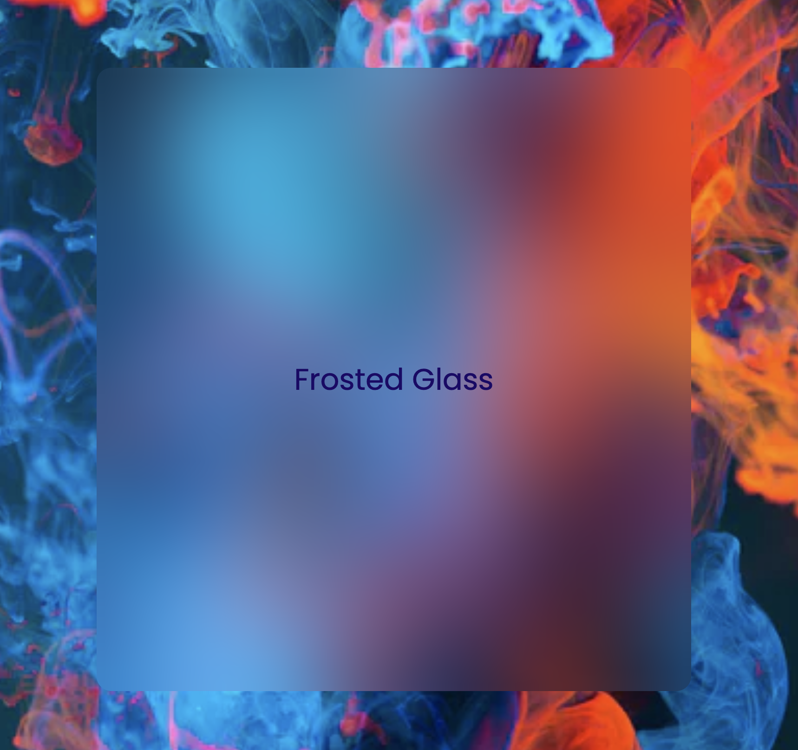
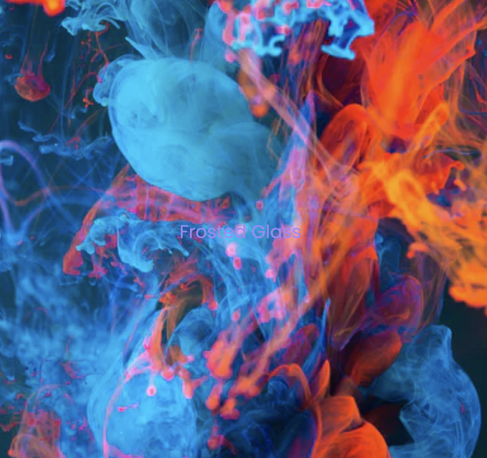
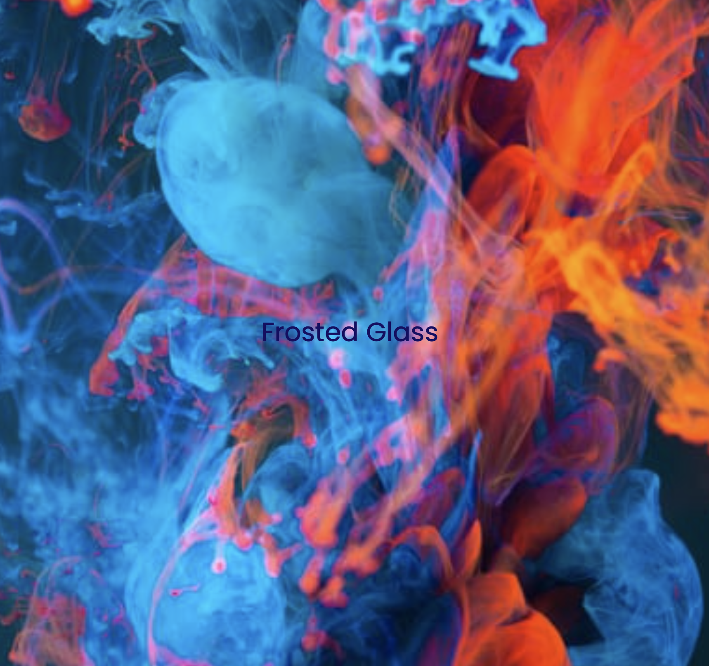
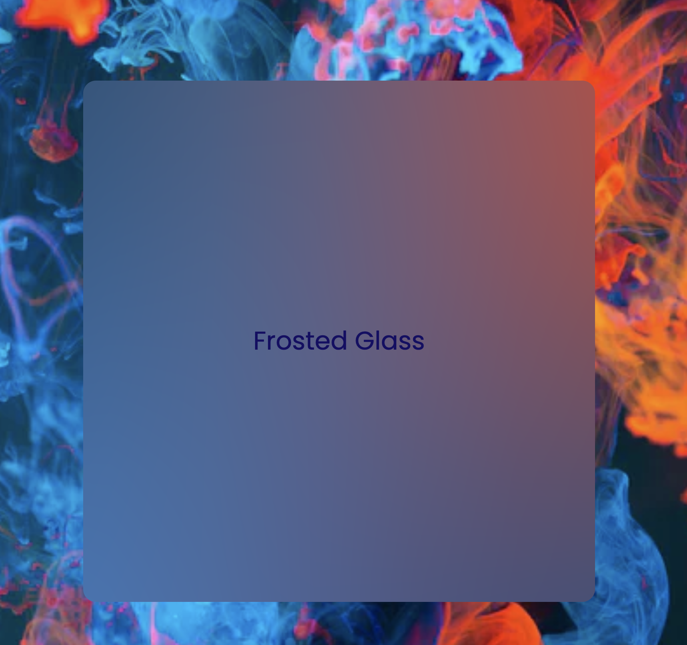

# Frosted Glass Effect CSS
in early 2021

In all pictures the effect is achieved by:
```css
    backdrop-filter: blur(999999px);
```

### Firefox with flags:

### Firefox without flags:

### Safari:

### Chrome

